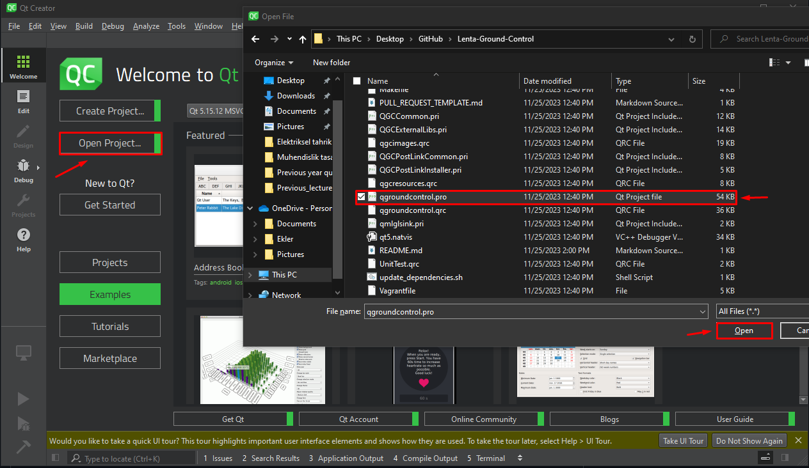

# **Pyrot V1.4**

# New features
- [x] Configured multiple camera stream window to display just one stream instead of three streams.
- [x] Changed captured videos path instead of /documents/pyrot/videos/VIDEO_NAME.mkv to /documents/pyrot/videos/VIDEO_CAPTURE_DATE/VIDEO_NAME.mkv

  
# Old features
## version 1.3 
- [x] Configured subtitle file to include time next to date, and include company name and ship name once the user fills them from application settings.
- [x] Implemented audio input while a video is being taken, this gets enabled through application settings.
- [x] Added backend logic and frontend UI for L2 & R2 buttons.
## version 1.2
- [x] Remove video control block.
- [x] Remove the parameters indicator block on the bottom of the screen.
- [x] Add depth, roll, pitch, heading bar.
- [x] Add toolbar to the left of the screen, toolbar includes: Joystick, Video record & Photo capture buttons, Notification icon.
- [x] Change all fonts to "Comic Sans MS".
- [x] Change all logos to pyrot's O letter's logo.
- [x] Configure subtitles to user needs.
- [x] Pyrot logo gets displayed when there is no live video feedback.
- [x] Remove initial units and vehicle frame prompts.
- [x] Update toolbar's colors and design.
## version 1.1
- [x] Move video control block to bottom right.
- [x] Create a red flashing circle when a video is being recorded.
- [x] Remove the 3 buttons on top left of main screen.
- [x] Remove roll, pitch and heading instrument on the top right.
- [x] Say 'Welcome Lenta Marine' when the program is ready to be used.
- [x] Make a custom toolbar.
- [x] Change messages icon to custom icon.
- [x] Change any original logo to Pyrot logo.
## version 1.0
- [x] Change app name to Lenta Ground Control Station.
- [x] Change app icon to Lenta Marine logo.  
- [x] 3 Extra livestream preview.


# Steps to build
1. Clone the repository:
   ```
   git clone https://github.com/joeshawky/Pyrot-PC.git --recursive
   ```
   `-b versionName` can be added to clone a certain branch


2. Launch QtCreator and launch project via selecting qgroundcontrol.pro

    

